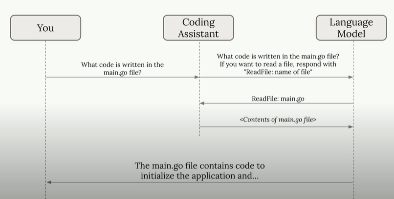
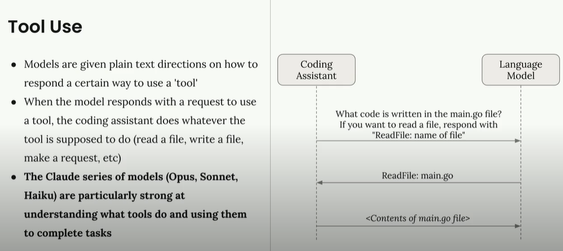
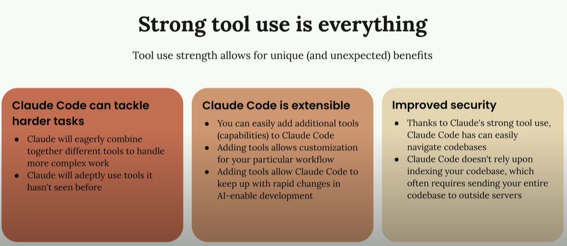
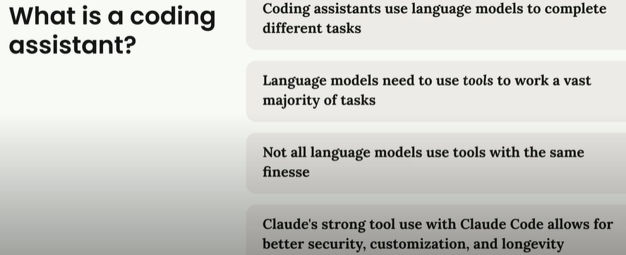

# Claude Code in Action

>Claude code tutorial from Claude 

## What is Claude Code

### What is an AI Coding Assistant?

An AI coding assistant is far more than a fancy autocomplete — it is a sophisticated system that combines large language models with real-world tool execution to tackle complex programming tasks from start to finish.









1. AI coding assistants use language models combined with tool execution to complete real-world programming tasks.
2. The "tool use" architecture lets models read files, run commands, and write code despite being fundamentally text-in, text-out systems.
3. Claude models are optimized for tool use, which makes Claude Code more capable, extensible, and secure than alternatives.
4. Understanding this architecture helps you give better instructions and get significantly better results.

---

### Claude Code: Tools in Action

Claude Code ships with a comprehensive set of built-in tools that handle everyday development tasks — reading files, writing code, running terminal commands, searching across directories, and managing your project structure. But what truly sets Claude Code apart is how intelligently it orchestrates these tools to solve complex, multi-step problems without manual intervention.

#### Built-in Tools at a Glance
Every Claude Code session gives you access to a powerful toolkit:

- File reading — inspect any file in your project to understand code structure and logic.
- Code writing and editing — create new files or modify existing ones with precise, targeted changes.
- Command execution — run shell commands like build scripts, test suites, linters, and package managers.
- Directory search — find files by name, search for patterns across your entire codebase with grep.
- Multi-file orchestration — coordinate changes across multiple files in a single task.

#### How Claude Code Chains Tools Together
The real power of Claude Code becomes visible when you give it a complex task. Rather than requiring you to break the work into tiny steps, Claude Code autonomously decides which tools to use and in what order.

For example, if you ask Claude Code to "add input validation to the user registration form," it might:

- Search the codebase to locate the registration form component and related validation utilities.
- Read the existing form code and any validation helpers already in the project.
- Plan the implementation based on what it learned about your existing patterns.
- Write the validation logic, matching your project's coding style.
- Run existing tests to verify nothing broke.
- Report what it changed and why.

Let Claude Code explore first

>For unfamiliar codebases, let Claude Code read and search before you start giving specific instructions. It builds a mental model of your project that dramatically improves the quality of subsequent changes.

#### Why This Matters for Your Workflow
Traditional code-completion tools suggest the next few tokens. Claude Code operates at a fundamentally different level — it reasons about your entire project, makes architectural decisions, and executes multi-step plans. This makes it valuable for tasks that would normally require significant developer time: refactoring across many files, implementing new features end-to-end, debugging complex issues, and writing comprehensive test suites.

#### Key Takeaways
1. Claude Code includes built-in tools for reading, writing, searching, and executing commands across your project.
2. It autonomously chains tools together to solve multi-step problems without manual guidance.
3. This agentic behavior makes Claude Code effective for complex tasks like refactoring, feature implementation, and debugging.
4. Letting Claude Code explore your codebase first leads to higher-quality changes.

---

## Setting Up Claude Code

### Installing Claude Code
```bash
# macOS (Homebrew)
brew install --cask claude-code

# macOS, Linux, and WSL
curl -fsSL https://claude.ai/install.sh | bash

# Windows (CMD)
curl -fsSL https://claude.ai/install.cmd -o install.cmd && install.cmd && del install.cmd
```

### First Launch and Authentication

After installation, open your terminal and run the claude command. The first time you launch Claude Code, it will prompt you to authenticate with your account. Follow the on-screen instructions to complete the sign-in flow.

```bash
claude
```

### Setting Up a Project

Claude Code works best when it has a project to explore. Navigate to any existing project directory and launch Claude Code from there. It will automatically detect your project structure and start building context about your codebase.

If you do not have a project handy, you can create a simple one to follow along with. Any codebase works — a React app, a Python script, a Go service, or even a static website. The key is having real files for Claude Code to read and modify.

1. Navigate to the project

Open a terminal and cd into your project directory.

2. Launch Claude Code

Run the claude command to start an interactive session.

3. Let Claude Code explore

Give Claude Code a moment to understand your project structure before asking it to make changes.

### Key Takeaways
1. Claude Code installs via a single command on macOS, Linux, Windows, and WSL.
2. Run claude in your terminal to start — first launch will prompt you to authenticate.
3. Optional: configure AWS Bedrock or Google Cloud Vertex AI for enterprise model access.
4. Launch Claude Code from inside your project directory for the best experience.

---

## Adding Context with CLAUDE.md

Master context management in Claude Code. Learn how to use /init, CLAUDE.md files, the # memory shortcut, and @ file mentions to give Claude the right information for every task.

Context is everything when working with an AI coding assistant. Your project might contain hundreds of files, but Claude only needs the right information to help you effectively. Providing too much irrelevant context actually degrades performance, so learning to guide Claude toward exactly the right files and documentation is one of the most impactful skills you can develop.

### The /init Command: Your First Step in Any New Project

When you first start Claude Code in a new project, run the /init command. This tells Claude to scan your entire codebase and build an understanding of:

- The project's purpose and high-level architecture
- Important commands for building, testing, and running the project
- Critical files and directories worth knowing about
- Coding patterns, conventions, and project structure

After analyzing your project, Claude generates a summary and writes it to a CLAUDE.md file. When prompted for permission, press Enter to approve or press Shift+Tab to let Claude write files freely for the rest of your session.

### Understanding CLAUDE.md Files

The CLAUDE.md file acts as a persistent system prompt for your project. It serves two purposes: guiding Claude through your codebase (pointing out architecture, commands, and coding style) and providing a place for you to add custom directions that shape how Claude behaves.

Claude recognizes CLAUDE.md files in three locations, each serving a different scope:

#### CLAUDE.md (Project)
- Generated with /init, lives in the project root
- Committed to source control and shared with your team
- Contains project-wide architecture notes and conventions


#### CLAUDE.local.md (Personal)
- Not shared with other engineers (gitignored)
- Contains your personal preferences and customizations
- Great for individual workflow tweaks

#### ~/.claude/CLAUDE.md (Global)
- Applies to all projects on your machine
- Contains instructions you want Claude to follow everywhere
- Perfect for language preferences, formatting rules, etc.

### The # Memory Shortcut

You can update your CLAUDE.md files without manually editing them. Use the # command to enter "memory mode" — simply type a hash followed by your instruction, and Claude will intelligently merge it into your CLAUDE.md file.

```
# Use comments sparingly. Only comment complex logic.
```

This is especially powerful for correcting repeated mistakes. If Claude keeps adding excessive comments, one quick memory command fixes the behavior for every future session.

### File Mentions with @

When you need Claude to focus on specific files, use the @ symbol followed by a file path. This directly includes that file's contents in your request, giving Claude immediate access without requiring it to search.

```
How does the auth system work? @src/auth
```

Claude will display a list of matching files for you to select from. You can also reference files directly in your CLAUDE.md to ensure they are included in every request — ideal for database schemas, API specs, or other foundational files.

In CLAUDE.md
```
The database schema is defined in @prisma/schema.prisma.
Reference it whenever you need to understand data structure.
```

### Key Takeaways
- Run /init first in every new project to generate a CLAUDE.md with project context.
- Three CLAUDE.md scopes exist: project-wide (shared), personal (local), and global (all projects).
- Use the # shortcut to add persistent memories without manually editing files.
- Use @ file mentions to include specific files in your request for precise, grounded answers.
- Reference critical files like schemas in CLAUDE.md so they are always available.

## Making Changes with Planning and Thinking Modes

Learn how to use screenshots, planning mode, and thinking modes in Claude Code to implement complex changes across your codebase with precision and confidence.

Making changes to a codebase is where Claude Code truly shines. Whether you need a quick UI tweak or a complex multi-file refactor, Claude Code provides powerful features — screenshots for visual communication, planning mode for broad changes, and thinking modes for deep reasoning — that help you implement changes with precision.

### Visual Communication with Screenshots

One of the most effective ways to communicate with Claude Code is through screenshots. When you want to modify a specific part of your UI, a screenshot eliminates ambiguity — Claude sees exactly what you are referring to.

Pasting screenshots
>Use Ctrl+V (not Cmd+V on macOS) to paste screenshots into the Claude Code chat interface. This keyboard shortcut is specifically designed for image input.

### Planning Mode for Multi-Step Changes

For complex tasks that require understanding many parts of your codebase, enable Planning Mode. This makes Claude Code perform thorough research across your project before implementing any changes.

Activate Planning Mode by pressing Shift+Tab twice (or once if you are already auto-accepting edits). In planning mode, Claude Code will:

- Read more files across your project to build comprehensive understanding
- Create a detailed implementation plan before writing any code
- Show you the plan and wait for your approval to proceed
- Give you the opportunity to redirect before any changes are made

### Thinking Modes for Deep Reasoning

Claude Code offers progressively deeper reasoning modes that allocate more tokens for the model to think through complex problems before responding:

- "Think" — basic extended reasoning for moderately complex problems
- "Think more" — deeper analysis for tricky logic
- "Think a lot" — comprehensive reasoning for architectural decisions
- "Think longer" — extended time for very complex analysis
- "Ultrathink" — maximum reasoning capability for the hardest problems

### When to Use Planning vs. Thinking

#### Planning Mode (breadth)

- Tasks requiring broad understanding of your codebase
- Multi-step implementations that touch many files
- Changes where you want to review the approach before execution

#### Thinking Mode (depth)

- Complex algorithmic or logic problems
- Debugging difficult, elusive issues
- Architectural decisions requiring careful trade-off analysis

#### Combine both for maximum effect

You can use planning mode and thinking modes together for tasks that require both breadth and depth. Ask Claude Code to "ultrathink" while in planning mode for the most thorough analysis possible. Note that both features consume additional tokens.

### Key Takeaways
1. Paste screenshots with Ctrl+V to communicate UI changes precisely.
2. Enable Planning Mode (Shift+Tab twice) for multi-file changes that need research first.
3. Use thinking modes ("think", "ultrathink", etc.) for complex logic and debugging.
4. Planning handles breadth; thinking handles depth. Combine them for the toughest tasks.

---

## Controlling Conversation Context

Master conversation control in Claude Code with escape to interrupt, double-escape to rewind, /compact to summarize, and /clear to reset. Keep Claude focused during long sessions.

Long coding sessions with Claude Code can accumulate irrelevant context that hurts performance. Learning to control the conversation flow — when to interrupt, rewind, summarize, or start fresh — is essential for keeping Claude focused and productive throughout complex development work.

### Interrupt with Escape

If Claude starts heading in the wrong direction or tries to tackle too much at once, press the Escape key to stop it mid-response. This lets you redirect the conversation without wasting time on an approach you already know is wrong.

This is particularly useful when Claude begins an overly ambitious plan. For example, if you ask it to write tests for multiple functions and it starts creating a comprehensive framework, interrupt and ask it to focus on one function at a time.

### Escape + Memory: Fix Repeated Mistakes

One of the most powerful patterns is combining the escape key with the memory shortcut. When Claude makes the same mistake repeatedly:

1. Press Escape to stop the current response
2. Use the # shortcut to add a memory about the correct approach
3. Continue the conversation with the corrected context

This prevents Claude from making the same error in future conversations on your project.

### Rewind with Double Escape

During long sessions, you may accumulate conversation history that is no longer useful — perhaps a debugging tangent or an abandoned approach. Press Escape twice to rewind the conversation. This shows all your previous messages and lets you jump back to an earlier point, preserving valuable context while removing distracting history.

### The /compact Command

The /compact command summarizes your entire conversation history into a condensed form while preserving the key information Claude has learned. Use it when:

- Claude has gained valuable knowledge about your project during the session
- You want to continue with related tasks without losing context
- The conversation has grown long but contains important learnings

### The /clear Command

The /clear command completely resets the conversation, giving you a blank slate. Use it when switching to a completely different, unrelated task where previous context would only cause confusion.

#### Choosing between /compact and /clear

> Use /compact when transitioning between related tasks — it keeps Claude's project knowledge. Use /clear when the next task is entirely unrelated — stale context can mislead Claude into making wrong assumptions.

### Key Takeaways

1. Press Escape to interrupt Claude when it heads in the wrong direction.
2. Combine Escape + # memory to permanently fix repeated mistakes.
3. Double-tap Escape to rewind and jump back to an earlier conversation point.
4. /compact summarizes the conversation while preserving learned context.
5. /clear resets everything for a fresh start on unrelated tasks.

---

## Building Custom Commands

Learn to create reusable custom slash commands in Claude Code that automate repetitive workflows like running audits, writing tests, and generating boilerplate code.

Claude Code comes with built-in slash commands, but the real productivity boost comes from creating your own. Custom commands let you automate repetitive workflows — running security audits, writing tests to your team's conventions, generating boilerplate — with a single slash command.

### Creating Your First Custom Command

Custom commands live in a specific folder structure inside your project:

#### 1. Find the .claude folder

Locate the .claude directory in your project root (created when you first use Claude Code).

#### 2. Create a commands directory

Inside .claude, create a new folder called commands.

#### 3. Add a markdown file

Create a .md file whose filename becomes the command name. For example, audit.md creates the /audit command.

#### 4. Restart Claude Code

Claude Code needs a restart to detect new command files.

### Example: A Security Audit Command

Here is a practical custom command that audits your project dependencies for known vulnerabilities and automatically applies safe fixes:

`.claude/commands/audit.md`

```text
Run a security audit on this project:
1. Run `npm audit` to identify vulnerable packages
2. Run `npm audit fix` to apply safe updates
3. Run the test suite to verify the updates did not break anything
4. Report which packages were updated and any remaining vulnerabilities
```

### Commands with Dynamic Arguments

Custom commands become even more powerful with the $ARGUMENTS placeholder, which lets you pass dynamic input when invoking the command:

`.claude/commands/write_tests.md`

```text
Write comprehensive tests for: $ARGUMENTS

Testing conventions:
* Use Vitest with React Testing Library
* Place test files in a __tests__ directory alongside the source file
* Name test files as [filename].test.ts(x)
* Use @/ prefix for all imports

Coverage:
* Test happy paths and expected behavior
* Test edge cases and boundary conditions
* Test error states and error handling
```

You can then invoke this command with any target:

`Claude Code prompt`

```bash
/write_tests the useAuth hook in src/hooks/use-auth.ts
```

#### Arguments are flexible

> The $ARGUMENTS placeholder accepts any text — file paths, feature descriptions, bug reports, or style guidelines. Think of it as a free-form input that gives your command flexibility while enforcing consistent process.

### Key Takeaways

1. Custom commands live in .claude/commands/ as markdown files.
2. The filename becomes the slash command name (audit.md → /audit).
3. Use $ARGUMENTS to accept dynamic input when the command is invoked.
4. Commands enforce consistency — every team member follows the same process.
5. Restart Claude Code after adding new command files.

---

## Extending Claude Code with MCP Servers

Claude Code's built-in tools handle common development tasks, but the Model Context Protocol (MCP) lets you go much further. MCP servers run locally or remotely and give Claude entirely new capabilities — browser automation, database queries, API monitoring, cloud service integration, and anything else you can expose through the protocol.

### What Are MCP Servers?

MCP servers are lightweight processes that expose tools through a standardized protocol. When you add an MCP server to Claude Code, the new tools appear alongside Claude's built-in capabilities. Claude can then use them in the same agentic way it uses file reading, code writing, and command execution.

### Installing the Playwright MCP Server

One of the most popular MCP servers is Playwright, which gives Claude the ability to control a real web browser — navigate pages, click elements, fill forms, and take screenshots of the result.

```bash
claude mcp add playwright npx @playwright/mcp@latest
```

This command registers the MCP server with the name "playwright" and tells Claude Code how to start it. Once installed, Claude gains browser automation tools in every session.

### Managing MCP Server Permissions

Claude Code asks for permission each time it uses a new MCP tool. If you want to skip the permission prompts, pre-approve the server in your settings:

`.claude/settings.local.json`

```json
{
  "permissions": {
    "allow": ["mcp__playwright"],
    "deny": []
  }
}
```

#### Double underscore syntax

> Notice the double underscores in mcp__playwright. This is the naming convention Claude Code uses to identify MCP server tools. Every tool from the playwright server will be prefixed with mcp__playwright__.

### Real-World Example: AI-Driven UI Improvement

Here is a powerful workflow that demonstrates the Playwright MCP server's potential. Instead of manually testing and tweaking UI generation prompts, you can ask Claude to:

1. Open a browser and navigate to your running application
2. Generate a test component through the UI
3. Analyze the visual styling and code quality of the output
4. Update your generation prompt based on what it observes
5. Test the improved prompt with a new component to verify the improvement

Because Claude can see the actual visual output — not just the code — it makes far more informed decisions about styling and layout improvements.

### The Growing MCP Ecosystem

Playwright is just the beginning. The MCP ecosystem includes servers for:

- Database interactions — query and modify databases directly from Claude
- API testing and monitoring — test endpoints and analyze responses
- Cloud service integrations — interact with AWS, GCP, and other cloud providers
- Development tool automation — run specialized dev tools programmatically
- File system operations — extended file management beyond built-in tools

### Key Takeaways

1. MCP servers extend Claude Code with new tools like browser automation, database access, and API testing.
2. Install servers with `claude mcp add [name] [command]` — they run locally on your machine.
3. Pre-approve MCP tools in settings.local.json to skip per-use permission prompts.
4. Claude can see visual output via Playwright, enabling AI-driven UI testing and improvement.
5. The MCP ecosystem is growing rapidly — explore servers that match your development workflow.

---

## GitHub Integration for Automated Workflows

Claude Code's GitHub integration transforms it from a local development assistant into an automated team member that reviews pull requests, responds to issue mentions, and executes tasks directly within your version control workflow. Setting it up takes minutes and can save your team hours of manual code review.

### Getting Started with /install-github-app

Run the /install-github-app command inside Claude Code to begin the setup process. The wizard will:

1. Install the Claude Code GitHub App on your repository
2. Guide you through adding your API key
3. Generate a pull request containing the GitHub Actions workflow files

Once you merge that initial PR, two GitHub Actions are added to your repository's .github/workflows directory.

### The Two Default Workflows

#### Mention Action: @claude in Issues and PRs

Mention @claude in any issue or pull request comment, and Claude will analyze the request, create a plan, execute the task with full codebase access, and post results directly in the thread. This is ideal for bug fixes, feature requests, and code questions.

#### Pull Request Review Action

Every time you open a pull request, Claude automatically reviews the changes, analyzes the impact of modifications, and posts a detailed review report. This gives you AI-powered code review on every PR without any manual steps.

### Customizing the Workflows

After merging the initial setup PR, you can customize the workflow files to fit your project's needs. Common customizations include adding project setup steps and custom instructions:

`.github/workflows/claude-mention.yml`

```yml
- name: Project Setup
  run: |
    npm run setup
    npm run dev:daemon
```

`Custom Instructions Block`

```text
custom_instructions: |
  The project is already set up with all dependencies installed.
  The server is running at localhost:3000.
  If needed, use the mcp__playwright tools to launch a browser.
```

### Configuring MCP Servers in GitHub Actions

You can give Claude access to MCP servers in GitHub Actions, but unlike local development, you must explicitly list every tool that Claude is allowed to use:

`Workflow Configuration`

```json
mcp_config: |
  {
    "mcpServers": {
      "playwright": {
        "command": "npx",
        "args": ["@playwright/mcp@latest", "--allowed-origins", "localhost:3000"]
      }
    }
  }

allowed_tools: "Bash(npm:*),mcp__playwright__browser_snapshot,mcp__playwright__browser_click"
```

> ⚠️ **Explicit tool permissions in CI**
>
> In GitHub Actions, there is no shortcut for permissions. Every tool from every MCP server must be individually listed in the allowed_tools configuration. This is a security requirement for automated environments.

### ✅ Key Takeaways

1. Run /install-github-app to set up automated code review and @claude mentions.
2. Two default workflows: PR review (automatic) and mention handling (@claude in issues/PRs).
3. Customize workflows with project setup steps, custom instructions, and MCP server configs.
4. In GitHub Actions, every MCP tool must be explicitly listed in allowed_tools.
5. Start with defaults and customize gradually as you learn what your team needs.

---

## Reference
- [Claude Code in Action: Master AI-Powered Development](https://claudecertifications.com/courses/claude-code-in-action)